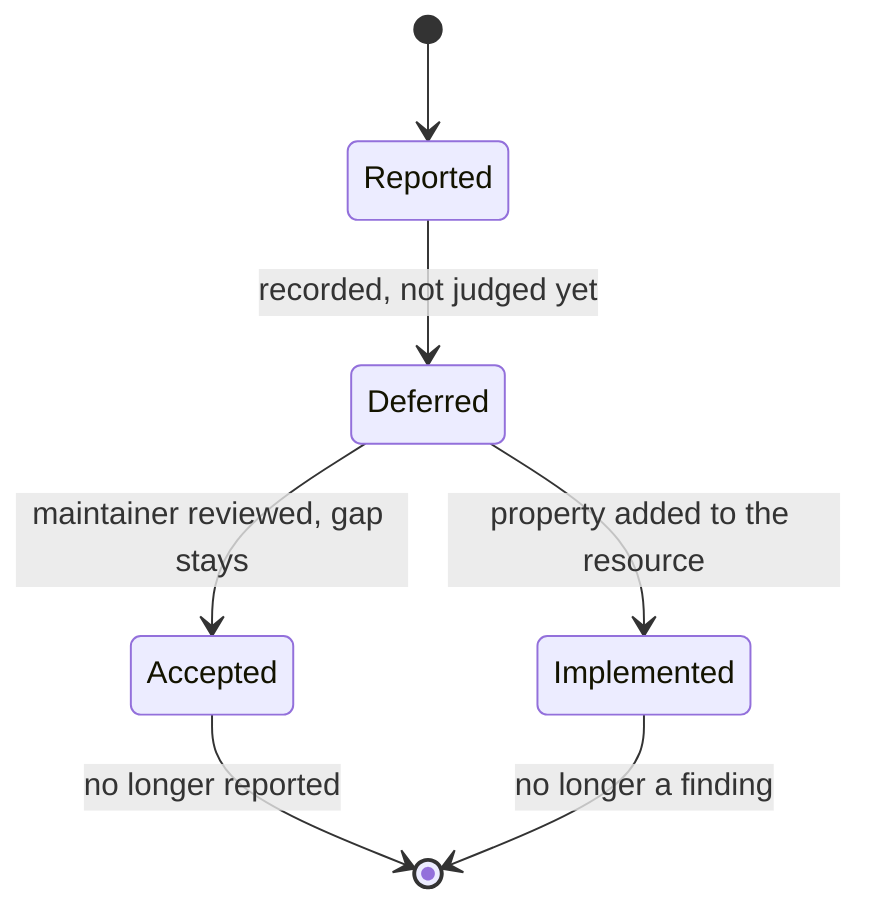
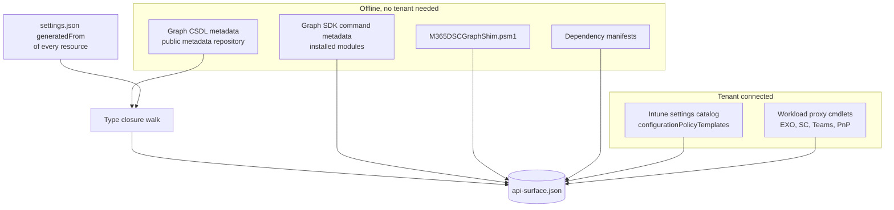
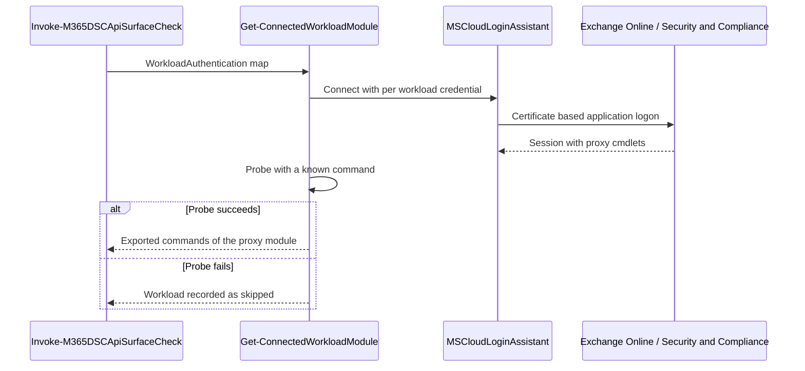
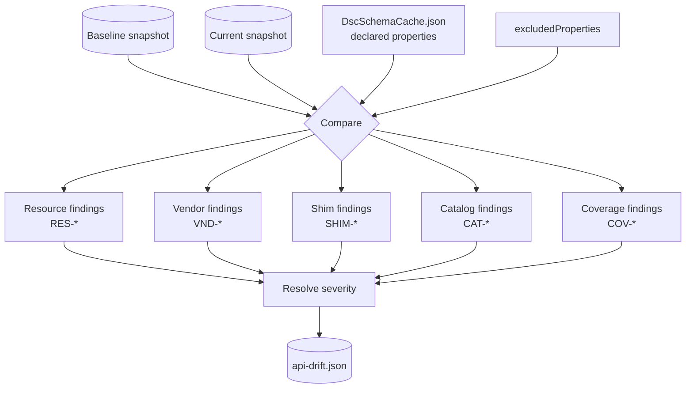
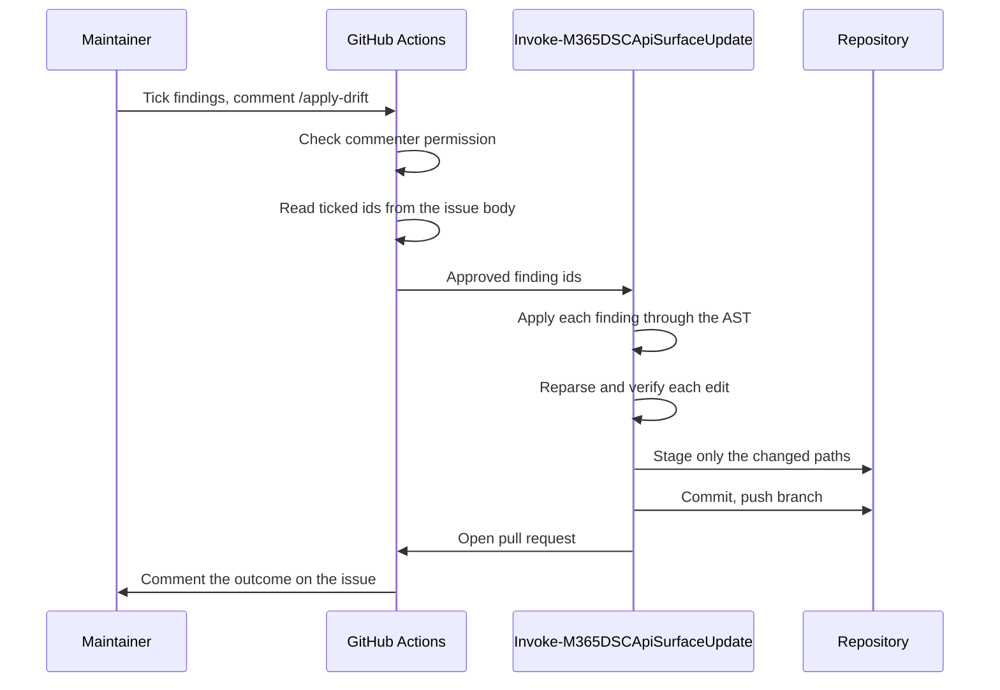
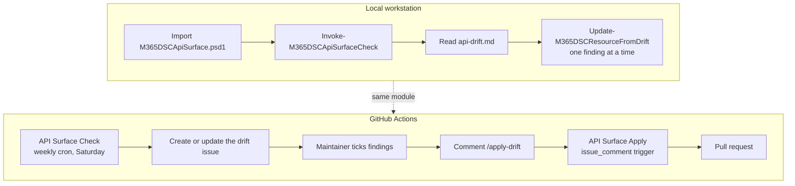
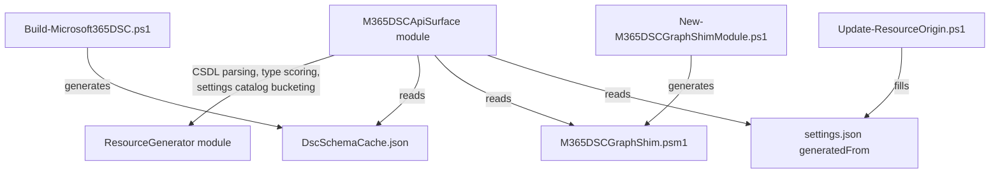

# API Surface Update Architecture

## Table of contents

1. [Introduction](#introduction)
2. [What the system compares](#what-the-system-compares)

    1. [The origin record](#the-origin-record)
    2. [The exclusion record](#the-exclusion-record)

3. [The four stages](#the-four-stages)
4. [Stage 1: Acquire](#stage-1-acquire)

    1. [Offline sources](#offline-sources)
    2. [Tenant connected sources](#tenant-connected-sources)
    3. [Connecting to Exchange Online and Security and Compliance](#connecting-to-exchange-online-and-security-and-compliance)
    4. [The completeness record](#the-completeness-record)

5. [Stage 2: Compare](#stage-2-compare)

    1. [Resource properties](#resource-properties)
    2. [Vendor surface and the shim](#vendor-surface-and-the-shim)
    3. [The settings catalog](#the-settings-catalog)
    4. [Severity](#severity)

6. [Stage 3: Report](#stage-3-report)
7. [Stage 4: Apply](#stage-4-apply)
8. [Local execution versus GitHub](#local-execution-versus-github)
9. [Supporting components](#supporting-components)
10. [What to take into account](#what-to-take-into-account)
11. [Running it by hand](#running-it-by-hand)

    1. [Regenerate what the comparison reads](#regenerate-what-the-comparison-reads)
    2. [Run the check](#run-the-check)
    3. [Read the result](#read-the-result)
    4. [Apply a finding](#apply-a-finding)
    5. [Which command after which change](#which-command-after-which-change)

## Introduction

Microsoft365DSC wraps around 531 cloud settings surfaces in DSC resources. Those surfaces move
underneath us. Microsoft adds a property to a Graph entity, retires a cmdlet, renames an enum
member or reshapes an Intune settings catalog template. Every one of those changes leaves a
resource slightly wrong, and nobody notices until a customer configuration fails.

The API surface tooling exists to notice. It takes a snapshot of what the vendor offers, compares
it to what the resources declare, and reports the difference as a list of findings. A maintainer
reads that list, ticks the findings that should be acted on, and the tooling turns the ticked ones
into a pull request.

This document describes how that pipeline is built and how its parts talk to each other. It covers
the module layout, the two execution contexts, the tenant connections and the data that moves
between stages. It does not walk through individual functions.

## What the system compares

Two sides feed the comparison.

The **vendor side** is what the cloud offers. For Microsoft Graph that is the CSDL metadata
document, which describes every entity type, complex type, enum and navigation property. For the
cmdlet based workloads it is the set of commands a connected session exposes. For Intune it is
additionally the settings catalog, which is served by the tenant and exists in no offline document.

The **resource side** is what Microsoft365DSC declares. Each resource is a PowerShell class with
`[DscProperty()]` members, and each resource folder carries a `settings.json` next to it.

The comparison only works when the tooling knows which vendor type a resource belongs to. That is
what the origin record answers.

### The origin record

Every `settings.json` carries a `generatedFrom` block.

```json
"generatedFrom": {
  "workload": "MicrosoftGraph",
  "apiVersion": "beta",
  "entityType": "servicePrincipal",
  "odataSubtype": null,
  "cmdletNoun": "MgBetaServicePrincipal",
  "cmdletVerb": "New",
  "includeNavigationProperties": true,
  "generatorVersion": "2.0.0"
}
```

The block names the workload, the API version, the Graph entity the resource maps to and the cmdlet
noun it is built on. `odataSubtype` names the concrete derived type when the entity is polymorphic.
A `deviceConfiguration` is not comparable on its own, because a Wi-Fi profile and a certificate
profile are both `deviceConfiguration` and share almost no properties. The subtype is what makes
the comparison meaningful.

`includeNavigationProperties` decides whether navigation properties count as members of the vendor
set. A resource that writes only structural properties keeps it false and avoids a long list of
navigation targets it never touches.

**Important.** A resource without a usable origin is skipped instead of guessed at. The comparison
reports it as skipped with a reason rather than producing findings against the wrong type. The
resources that cannot be resolved are listed in `Utilities/ApiSurface/generatedfrom-unresolved.md`
and allowlisted in the settings QA test.

### The exclusion record

The same file carries an `excludedProperties` array. It records the properties that will never
match the vendor set and states why.

```json
{
  "name": "ObjectID",
  "reason": "NotConfigurable",
  "note": "ObjectID echoes the service assigned service principal id."
}
```

The reason comes from a closed set of five values.

| Reason | Meaning |
| --- | --- |
| `ReadOnly` | The service returns the value and never accepts it. |
| `NotConfigurable` | The property is a DSC mechanism rather than a service setting. |
| `Deprecated` | The vendor retired the property and the resource keeps it for compatibility. |
| `OwnedByOtherResource` | Another resource writes it. |
| `Deferred` | A real gap that has not been closed yet. |
| `Accepted` | A maintainer reviewed the gap and decided it stays open. |

Every reason except `Deferred` suppresses the finding. `Deferred` lowers the severity to `info` and
keeps the finding visible. That distinction is what stops the report from turning into noise while
still tracking work that remains open.

`Deferred` and `Accepted` describe the same kind of gap at two points in its life. A property lands
on `Deferred` when nobody has judged it yet, and it keeps showing up in the report until somebody
does. Moving it to `Accepted` records that the judgement happened and the answer was to leave the
gap in place. The report stops mentioning it from that point on.



**Important.** A vendor property the service owns, such as `createdDateTime`, `deletedDateTime`,
`modifiedDateTime`, `lastModifiedDateTime` and `version`, never needs an exclusion entry. The
comparison classifies those as `RES-PROP-READONLY` on its own. The CSDL annotates most of them as
read only, but not on every type, and the default list closes that gap.

## The four stages

The pipeline is four stages with a file boundary between each one. Every stage can run on its own,
and every boundary is a plain JSON or Markdown file that any normal person can read.


The public surface of the module maps onto those stages.

| Function | Stage | What it does |
| --- | --- | --- |
| `Get-M365DSCApiSurface` | Acquire | Captures the vendor snapshot. |
| `Compare-M365DSCApiSurface` | Compare | Turns two snapshots plus the resources into findings. |
| `Invoke-M365DSCApiSurfaceCheck` | Acquire, Compare, Report | The end to end entry point. |
| `Update-M365DSCResourceFromDrift` | Apply | Applies one finding to one resource. |
| `Invoke-M365DSCApiSurfaceUpdate` | Apply | Applies a set of findings and opens the pull request. |

## Stage 1: Acquire

`Get-M365DSCApiSurface` writes one snapshot document, `Utilities/ApiSurface/api-surface.json`. The
snapshot has sections for Graph types, cmdlets, dependencies, the shim and the settings catalog,
plus a `completeness` block that records what the run managed to see.



### Offline sources

Most of the capture needs no tenant at all.

The **CSDL metadata** is downloaded from the public `msgraph-metadata` repository and cached under
`%LOCALAPPDATA%\M365DSC\ResourceGenerator` for seven days. The tooling does not walk the whole
document. It seeds a queue from the `entityType` and `odataSubtype` of every resource origin, then
follows complex types until the closure is complete. Navigation targets of the seed types are
captured as well, but only up to one level deep. Following them further would pull `user`, `group` and
`directoryObject` into the closure and cascade across the entire graph, resulting in huge documents.

The **Graph SDK command metadata** comes from the installed `Microsoft.Graph.*` modules and gives
each cmdlet its route, its method and its parameter types.

The **shim** is `Modules/Microsoft365DSC/Modules/M365DSCGraphShim.psm1`, a generated module that
re-exports every Graph SDK cmdlet the resources call as a thin wrapper over `Invoke-MgGraphRequest`
and `Invoke-MgxRequest`. It is read to check that every declared cmdlet has a wrapper.

### Tenant connected sources

Two sections need a live tenant.

The **Intune settings catalog** is served by Graph and doesn't exist in any of the offline documents.
The capture reads the configuration policy templates, then each template's setting templates with their
setting definitions expanded. A pinned list of templates keeps the capture stable between runs.

The **workload cmdlet surface** for Exchange Online, Security and Compliance, Teams and PnP is the
set of commands those sessions expose. Those commands are proxies that only exist after a
connection.

**Important.** The settings catalog is fetched over the `MicrosoftGraph` connection, not the
`Intune` one. Whichever application registration answers for `MicrosoftGraph` needs
`DeviceManagementConfiguration.Read.All`. A registration without it returns 403, the section is
dropped and the run continues without failing.

### Connecting to Exchange Online and Security and Compliance

Exchange Online and Security and Compliance are reached through MSCloudLoginAssistant. The capture
builds a connection parameter set per workload, connects, then probes the session with a command it
knows should exist. `Get-Mailbox` proves Exchange Online. `Set-ComplianceCase` proves Security and
Compliance. When the probe succeeds the temporary proxy module is read and its exported commands
become that workload's surface.



One application registration rarely serves every workload. Exchange Online and Security and
Compliance normally hold their own. The `WorkloadAuthentication` parameter carries a per workload
override keyed by workload name, and falls back to the top level credential when a workload has no
entry.

### The completeness record

Every capture records what it saw.

```json
"completeness": {
  "tenantConnected": true,
  "skippedWorkloads": [],
  "tenantError": null
}
```

A workload that could not be connected lands in `skippedWorkloads`. The comparison then suppresses
findings for that workload rather than reporting everything in it as removed. A connection failure
downgrades a run. It never fails one.

**Important.** When the run writes a new baseline, it first checks that it saw at least as much as
the committed baseline. A run that lost a section refuses to overwrite. This is the guard that
stops a degraded capture from silently becoming the new reference.

## Stage 2: Compare

`Compare-M365DSCApiSurface` takes the previous snapshot, the current snapshot and the resources,
and produces findings. Each finding carries an id, a code, a severity, a subject and evidence.
The outcome is written to `Utilities/ApiSurface/api-drift.json`.



### Resource properties

This is the part that produces most of the value. For every comparable resource the tooling expands
the vendor type into a set of property paths, then matches each declared DSC property against it.

The expansion flattens complex types into dotted paths. `sessionControls.signInFrequency.isEnabled`
is one entry in the set, and it is keyed by that whole path rather than by the leaf name. Keying by
the leaf would collapse the six different `isEnabled` properties on a conditional access policy into
one.

The matcher then tries a ladder of rules against each declared name, from exact match down to a
suffix of a flattened path. A resource that declares `SignInFrequencyIsEnabled` matches
`sessionControls.signInFrequency.isEnabled` because the concatenated suffix is equal. When several
vendor paths match, the shallowest one wins.

Properties that match nothing become `RES-PROP-ORPHANED`. Vendor properties that no resource
declares are counted as backlog rather than reported one by one.

### Vendor surface and the shim

The vendor comparison looks at what moved between the two snapshots. A cmdlet that disappeared from
the surface while a resource still calls it is `VND-CMDLET-REMOVED`. A cmdlet that disappeared and
that no resource calls any more is `COV-CMDLET-UNUSED`, which is a coverage note rather than a
breakage. Routes that moved, parameters that changed type and enum members that appeared are
reported under their own codes.

`SHIM-MISSING` fires when a resource declares a Graph cmdlet that the generated shim does not
export. That happens whenever a resource changes its cmdlet set without the shim being regenerated.

### The settings catalog

The catalog comparison walks the pinned templates and their setting definitions. A setting that
appeared, a setting that vanished, a new option on a choice setting and a template version bump are
each their own code.

**Important.** Setting names are not unique inside a template. The generator disambiguates them by
counting how often a name occurs inside a bucket of setting templates, then prefixing with the
parent name when it collides. Device scoped and user scoped templates form separate buckets. The
capture mirrors that bucketing exactly. A capture that unions all templates together would rename
settings that legitimately stay bare.

### Severity

Every code maps to a severity and an auto fixable flag.

| Severity | Meaning |
| --- | --- |
| `breaking` | A resource is wrong today. |
| `warning` | Something changed that a maintainer should look at. |
| `info` | Recorded and tracked, no action expected. |

An `excludedProperties` entry with one of the four permanent reasons removes the finding. An entry
with `Deferred` lowers it to `info`.

## Stage 3: Report

Two renderings come out of the same drift document.

`api-drift.md` is the full report. Every section states its count even when empty, and the same
input renders byte identical every time. That property matters, because the report is compared
between runs.

The GitHub issue body is the approval interface. It groups findings into sections ordered by how urgently
a maintainer has to act, and it renders the auto fixable section as a checklist.

```markdown
## Auto-fixable  (tick, then comment /apply-drift)  (5)

- [ ] `RES-ENUM-STALE:AADConditionalAccessPolicy:ServicePrincipalRiskLevels`
      csdl:beta/riskLevel adds hidden
```

A tick in that list is the approval. Nothing else in the body is read back.

## Stage 4: Apply

`Update-M365DSCResourceFromDrift` applies a single finding to a single resource. It edits the class
file through the AST and it verifies the result by reparsing the file and checking that the property
now has the shape the finding asked for.

Only a narrow set of codes may be applied without a human writing code.

| Code | Edit |
| --- | --- |
| `RES-ENUM-STALE` | Add the missing member to a `ValidateSet`. |
| `VND-ENUM-MEMBER-ADDED` | Add the new member to a `ValidateSet`. |
| `RES-PROP-MISSING` | Add the property to the class. |

Everything else is refused. A removed cmdlet, a rerouted cmdlet, a type mismatch and every settings
catalog code need a decision that the tooling is not entitled to make.

`Invoke-M365DSCApiSurfaceUpdate` wraps the single finding function. It applies the approved set,
stages only the paths it actually changed, commits, pushes a branch and opens the pull request.



**Important.** The apply run stages only the files it edited. A blanket stage would sweep unrelated
working tree changes into the drift commit.

## Local execution versus GitHub

The same module runs in both places. The difference is what triggers it and where the credentials
come from.



The **check workflow** runs weekly on a Windows runner. It installs the dependencies, builds the
class modules, generates the schema cache, downloads the previous drift report from the last run,
reads the currently open issue body to keep existing ticks alive, then runs the check. It creates
the drift issue when none is open and edits the existing one otherwise.

The **apply workflow** triggers on an issue comment. It checks that the commenter has write
permission before doing anything else, resolves which findings were ticked, applies them and opens
the pull request. It comments the outcome back onto the issue.

Credentials differ by context. Locally the operator passes an application id, a tenant id and a
certificate thumbprint, optionally with a per workload override map. On the runner those come from
repository secrets. When the certificate secret is absent, the workflow sets a flag and the run
degrades to the offline capture rather than failing.

| Secret | Use |
| --- | --- |
| `RUNNERAPPID` | Application id of the registration used for the tenant capture. |
| `RUNNERTENANTID` | Tenant the capture connects to. |
| `RUNNERCERTIFICATETHUMBPRINT` | Certificate installed on the runner. |

**Important.** `TenantId` is the domain name, not the GUID. The connection builder rejects a GUID.

## Supporting components

The API surface module does not own everything it needs.



The **ResourceGenerator** module owns the CSDL parsing, the type candidate scoring and the settings
catalog bucketing. The API surface module calls into it rather than keeping a second copy of that
logic.

`Build-Microsoft365DSC.ps1` compiles the per resource class files into the part modules the shipped
module loads, and regenerates `DscSchemaCache.json`. The comparison reads that cache to learn what
each resource declares. A stale cache means the comparison measures the wrong thing.

`New-M365DSCGraphShimModule.ps1` regenerates the shim from the cmdlet sets the resources declare.

`Update-ResourceOrigin.ps1` derives the `generatedFrom` block for a resource from its module, its
commands array and the CSDL. It never guesses. Whatever it cannot derive lands in the unresolved
worklist with the reason. A fact recorded by hand that the script cannot derive again is kept rather
than overwritten with a null.

## What to take into account

A few rules hold the pipeline together.

**Build before you compare.** The comparison reads the generated schema cache, not the resource
source files. A check run against a stale cache reports drift that does not exist.

**Regenerate the shim when a resource changes its cmdlet set.** Moving a resource to a beta cmdlet
noun leaves the old wrappers behind and the new ones missing. A QA test catches this before the
check does.

**Regenerate the shim before capturing a baseline, never after.** A baseline captured against the
old cmdlet surface disagrees with the regenerated signatures on every parameter type.

**A new entity type produces one noisy run.** `RES-PROP-MISSING` fires for properties that are
absent from the baseline and present now. Pointing a resource at an entity the baseline never
captured makes every undeclared property look new. Those settle into the coverage backlog on the
next capture.

**Record why, not just what.** An `excludedProperties` note that names the concrete type and the
vendor property is worth writing. `Declared on the macOSPkgApp type from property postInstallScript`
tells the next reader everything. A generic note tells them nothing.

## Running it by hand

Editing a `settings.json` or a resource class by hand is normal. What matters is running the right
regeneration afterwards. The comparison never reads the files you edited. It reads generated
artifacts, and a stale artifact is the most common reason a local run disagrees with the weekly one.

### Regenerate what the comparison reads

```powershell
# Fills the generatedFrom block of every resource that does not already carry a resolved one.
# Only needed for a new resource or after a commands array changed.
./Utilities/Update-ResourceOrigin.ps1

# Regenerates the shim from the cmdlet sets the resources declare.
# Only needed when a resource gained, lost or renamed a Graph cmdlet.
./Utilities/New-M365DSCGraphShimModule.ps1

# Compiles the class files and regenerates DscSchemaCache.json and ResourcePermissions.json.
# Needed after ANY change to a settings.json or a resource class.
./Utilities/Build-Microsoft365DSC.ps1
```

The build is the one that is easy to forget. `DscSchemaCache.json` is the only source of declared
properties the comparison has, and `ResourcePermissions.json` is compared against every
`settings.json` by a QA test.

### Run the check

The offline run needs no tenant and covers Graph types, cmdlets, the shim and the dependencies.

```powershell
Import-Module ./Utilities/ApiSurface/M365DSCApiSurface.psd1 -Force

Invoke-M365DSCApiSurfaceCheck -MarkdownPath ./Utilities/ApiSurface/api-drift.md
```

Add the tenant only when the settings catalog or the cmdlet workloads matter.

```powershell
Invoke-M365DSCApiSurfaceCheck -IncludeTenantConnected `
    -ApplicationId $clientIdIntune `
    -TenantId $tenantIdName `
    -CertificateThumbprint $certThumbprintIntune `
    -WorkloadAuthentication @{
        ExchangeOnline           = @{ ApplicationId = $clientIdEXO; CertificateThumbprint = $certThumbprintEXO }
        SecurityComplianceCenter = @{ ApplicationId = $clientIdSC;  CertificateThumbprint = $certThumbprintSC }
    } `
    -MarkdownPath ./Utilities/ApiSurface/api-drift.md
```

Add `-UpdateBaseline` only when you intend to move the reference point. A run that saw less than the
committed baseline refuses to write, which is the guard described earlier.

### Read the result

`api-drift.md` is the readable report. For one resource the JSON is faster.

```powershell
$drift = Get-Content ./Utilities/ApiSurface/api-drift.json -Raw | ConvertFrom-Json

$drift.findings | Where-Object { $_.resource -eq 'IntuneMobileAppsBundleMacOS' }
$drift.coverage | Where-Object { $_.resource -eq 'IntuneMobileAppsBundleMacOS' }
```

An `excludedProperties` entry is dead once its property no longer appears as `RES-PROP-ORPHANED`.
Removing a dead entry keeps the file honest.

### Apply a finding

```powershell
Update-M365DSCResourceFromDrift -FindingId 'RES-ENUM-STALE:AADConditionalAccessPolicy:ServicePrincipalRiskLevels'
```

Rebuild afterwards and run the check again to confirm the finding is gone.

### Which command after which change

| What changed | What to run |
| --- | --- |
| A DSC property on a resource class | Build, then check. |
| `generatedFrom` or `excludedProperties` | Build, then check. |
| The cmdlets a resource calls | Shim generator, then build, then check. |
| A new resource | Origin script, shim generator, build, then check. |
| Nothing, you only want today's drift | Build, then check. |

**Important.** Regenerate the shim before you capture a baseline, never after. A baseline taken
against the old cmdlet surface disagrees with the regenerated signatures on every parameter type,
and the next run reports a wave of parameter findings that clears itself.
