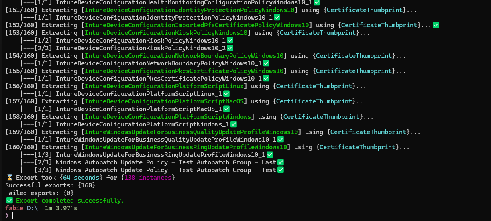
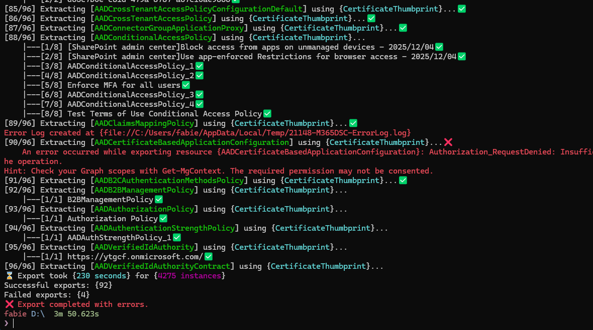

# From Script-Based to Class-Based, Part 2: Making the Module Fast Again

<b>by <a href="https://www.linkedin.com/in/fabien-tschanz">Fabien Tschanz</a> 
September 14th, 2026</b>

 
 

## Introduction

[Part 1](./class-based-resources.md) ended on an uncomfortable note. The module worked, but it was slower than the one it replaced: importing, discovering resources, parsing an export, and comparing a tenant against a blueprint all took longer. Each cost looked small alone, but every user would be paying them every day.

This part follows the work to win those seconds back. We measured import, discovery, DSCParser, the base class, the export engine, and the comparison engine (basically everything we could). The method stayed simple: measure, find the floor, test ideas, keep what helped, and report what did not.

Unless a table says otherwise, these numbers come from my Surface Laptop 6 for Business with an Intel Core Ultra 7 165H, 32 GB of RAM, PowerShell 7.6.5, and Windows PowerShell 5.1. Every sample ran in a fresh process with one Microsoft365DSC version on `PSModulePath`, staged through a directory junction. [Part 3](./class-based-resources-part-3.md) estimates what these numbers will look like on a CI runner.

## Table of Contents

1. [Where the import time actually goes](#where-the-import-time-actually-goes)
2. [An updated bucket strategy](#an-updated-bucket-strategy)
3. [Three layouts we evaluated](#three-layouts-we-evaluated)
4. [The FunctionsToExport trap, revisited](#the-functionstoexport-trap-revisited)
5. [DSCParser: parsing exports without paying for discovery](#dscparser-parsing-exports-without-paying-for-discovery)
6. [The base class under a profiler](#the-base-class-under-a-profiler)
7. [The export engine, workload by workload](#the-export-engine-workload-by-workload)
8. [The compiled comparison engine](#the-compiled-comparison-engine)
9. [The small things that add up](#the-small-things-that-add-up)
10. [The correct way of measuring](#the-correct-way-of-measuring)
11. [Where part 2 leaves us](#where-part-2-leaves-us)

## Where the import time actually goes

Part 1 measured the spike layout at 6.95 seconds, but that spike used stub method bodies. The shipped module contains 531 resource classes with full `Get`, `Set`, and `Test` implementations, 469 complex-type classes, 28 helper modules, and 54 nested modules. I measured it again in a fresh process beside the last script-based release, with some other numbers in the result, but the story stayed the same: class-based resources are slower to import.

| Layout | Import, PowerShell 7 / Windows PowerShell | Second runspace, same process | Working set | `Get-Module -ListAvailable` |
| --- | --- | --- | --- | --- |
| 1.26.826.1, script-based | 1.67 s / 1.97 s | 0.97 s / 1.10 s | 178 MB | 0.12 s / 0.10 s |
| Class-based, 16 parts and 8 type buckets | 4.96 s / 5.67 s | 2.87 s / 3.62 s | 386 MB | 1.13 s / 0.74 s |

The first import costs three more seconds, but the second column hurts more. PowerShell's class type cache does not survive a runspace, so another runspace in the same process recreates every type. The LCM and the PowerShell 7 relay from Part 1 open a runspace for each call. A fresh copy or installation is slower again at 8.7 to 11.7 seconds on PowerShell 7, because changed write times invalidate the module analysis cache and `Import-Module` re-analyzes all 54 nested modules.

We then broke apart the built `Classes/` folder and imported scratch variants of the same files on PowerShell 7:

| Variant | Total | What it tells you |
| --- | --- | --- |
| As built | 9.1 s | |
| Every method body replaced by a stub | 7.3 s | bodies are parse cost, 1.8 s on PowerShell 7 and 5.7 s on Windows PowerShell |
| `[ValidateSet]` attributes removed | 7.3 s | no effect at all |
| Only `Get`, `Set` and `Test` kept | 4.7 s | the hidden helper methods cost 2.7 s |
| Properties only, no methods | 3.8 s | the type creation floor, about 5.5 ms per resource class |

PowerShell creates class types when it *compiles* a file, before any statement runs, and `Import-Module` compiles every `NestedModules` entry. DSC class discovery sees only `RootModule` and one level of `NestedModules`, so every discoverable resource compiles eagerly. The 3.8-second floor is the cost of creating about a thousand classes. Method count costs roughly half a millisecond per method while attribute count does not matter, and the helper methods moved into classes in Part 1 cost more at import time than the resource bodies.

## An updated bucket strategy

The spike suggested that bucket size was the lever we could use to adjust import time. Fewer classes per file should reduce superlinear type creation and speed up imports. We therefore added `-BalanceBy Count|Bytes` to `Build-Microsoft365DSC.ps1`. We also added part count, type bucket count, second runspace, and `using module` axes to `Measure-M365DSCLoadPerformance.ps1`. Then we swept the real tree across eight, sixteen, and thirty-two parts with four, eight, and sixteen type buckets, balanced by class count and by bytes, using medians of three.

Eighteen layouts later, imports ranged from 4.2 to 5.0 seconds on PowerShell 7 and 5.1 to 6.5 on Windows PowerShell. A second runspace ranged from 3.1 to 4.1 seconds, `using module` from 5.1 to 6.8 seconds, and a parse-only pass from 1.7 to 2.4 seconds. All layouts landed in the same noise band. The spike's cube curve is real for a thousand classes in one file, but it flattens once classes spread across more than a few files. The defaults remain 16 and 8, with the sweep tooling left in the repository for anyone who wants to verify it. Or if you just want to play around with it, that is.

## Three layouts we evaluated

If every class DSC can discover compiles at import, getting below that floor requires something cheaper for DSC to discover. We built three candidates, staged each as a complete module, and ran them through the real engines.

**D1, a MOF facade with lazy classes.** DSC sees 531 MOF-based resources, each with a generated `.schema.mof` and a tiny script shim whose `Get-TargetResource` imports the part holding the real class on first use and then forwards the call. The classes are all still there, but nothing gets discovered eagerly.

**D2, a class facade with lazy implementation.** DSC sees 531 property-only classes with no method bodies, whose `Get`, `Set` and `Test` import the implementation part on first use and relay to it.

**D3, keep the eager layout and cut its cost** by moving helper methods and bodies out of the 531 classes.

| | Current | D1 MOF facade | D2 class facade | D3 cut cost |
| --- | --- | --- | --- | --- |
| Import, PowerShell 7 / Windows PowerShell | 4.96 s / 5.67 s | **1.29 s / 1.54 s** | 2.44 s / 3.38 s | about 4 to 5 s |
| Per additional runspace | 2.87 s / 3.62 s | 0.46 s / 0.52 s, plus 0.1 to 0.2 s per part touched | 1.79 s / 2.21 s, plus 0.09 s per part | as import |
| First resource instance | 0.15 s after the import | 0.67 s / 0.88 s | 0.33 s / 0.40 s | as current |
| Discovery through the DSC engines | 18 to 20 s | 7 s | 6 to 7 s | 18 to 20 s |
| Working set | 386 MB | 178 MB | 275 MB | about 386 MB |
| Compile of the 726-instance export, classic path | 55 s | 13.3 s | as current | as current |

D1 imports in 1.29 seconds against 1.67 for the old release, with the same working set, and the classic compile path recovers most of its speed because the engine reads MOF files instead of creating types. D2 halves the current import, meaning both work on their own terms.

But building them exposed two requirements. One, lazy imports must use `Import-Module -Global`, because importing a part from the shared base module's scope made `GetExportedTypeDefinitions` recurse until the stack overflowed, and second, a `.psd1` resource map also failed because the engine rejects dynamic expressions in data files. A JSON map and global imports fixed both facades.

We decided to ship neither of the two designs. [Part 3](./class-based-resources-part-3.md#dscv3-what-323-makes-of-the-module) explains why in more detail. In short: DSCv3's PowerShell adapter drives class-based resources only, while MOF resources run only through the Windows PowerShell adapter and the current adapter cannot name a class in a nested file. D1 recovers import time but rules out DSCv3. D2 preserves that option but shares the current nested-file naming problem. At the end, the current layout remains while the measurements and generators stay ready for the adapter to change.

## The FunctionsToExport trap, revisited

Part 1 showed that an explicit `FunctionsToExport` list makes every class-based resource disappear from `Get-DscResource`. In September, when I investigated something related to module loading performance, I found that `Get-Module -ListAvailable` appeared in every profile at 1.1 seconds per call, so I returned to the engine source to understand the tradeoff.

The mechanism lives in `ModuleCmdletBase`. When a manifest has explicit `FunctionsToExport`, `CmdletsToExport`, and `AliasesToExport` with no wildcards, `Get-Module -ListAvailable` builds module information from the manifest without loading nested modules, but its early return happens before the engine records `DscResourcesToExport`. Every DSC engine we tested checks `ExportedDscResources.Count -gt 0` before proceeding: inbox 1.1, gallery 2.0.7, our fork, and DSCParser's `Get-DscResourceV2`. The result is that zero resources are returned with no error.

| Manifest variant | `Get-Module -ListAvailable`, PS 7 / WPS | `ExportedDscResources` | `Import-Module`, cold analysis cache | `Get-DscResourceV2` | Fast host / 2.0.7 / inbox 1.1 |
| --- | --- | --- | --- | --- | --- |
| key absent (shipped) | 1.27 s / 0.80 s | 531 | 8.7 s / 5.8 s | 531 in 4.0 s | 999 / 999 / 531 |
| `'*'` | 1.27 s / 0.87 s | 531 | 8.6 s / 6.0 s | 531 in 3.3 s | 999 / 999 / 531 |
| explicit list | 1.84 s / 0.08 s | 0 on PS 7, 531 on WPS | 4.6 s / 5.9 s | **0** | **0 / 0 / 0** |
| explicit list plus `AliasesToExport = '*'` | 0.07 s / 0.07 s | 531 | 4.4 s / 4.9 s | **0** | **0 / 0 / 0** |

The final row looked promising because it retained the fast early return for functions and cmdlets, added a wildcard to the alias list, and made `ExportedDscResources` available. Every DSC engine still returned zero resources because discovery follows a different path that the early return had already starved.

Therefore, to get the DSC resources out of the module, the key remains absent, costing about 1.2 seconds per `Get-Module -ListAvailable` and about 4 seconds per `Import-Module` on a cold analysis cache. Internal consumers in the module itself now avoid `Get-Module -ListAvailable` where possible, with the fast host scanning `PSModulePath` for the manifest and DSCParser caching the module catalog once per process.

## DSCParser: parsing exports without paying for discovery

DSCParser turns a `.ps1` configuration back into objects for `Compare-M365DSCConfigurations`, blueprint assertions, delta reports, and the examples QA gate, so its cost multiplies through every export reader. Its March 2026 C# rewrite improved correctness and speed, but class-based resources introduced the same discovery cost seen elsewhere, which three releases in August and September addressed.

**3.1.0.0, the refactor pass (August 7).** Profiling found a type-name conversion that looped over every discovered resource name for every property before returning the same string on both branches, along with seven copies of one reflection lookup into `DscClassCache`, including three inside per-resource loops. It also found a fresh property list per read, a `Get-Module -ListAvailable` call per module, and a writer that re-split and re-indented output at every nesting level. Replacing them with one cached reflection helper reduced writing a resource with 25 nested instances at five levels from 200 to 54 milliseconds, byte-identical, while parsing a tiny configuration 25 times fell from 3.0 to 1.7 seconds.

**3.1.0.0, keyword pre-cache (August 9).** The compiler issue in Part 3 also affected every DSCParser parse. PowerShell rebuilds DSC keyword registration whenever it parses a configuration with `Import-DscResource`, probing the file system for each resource. DSCParser now keeps that registration for the process, removes `Import-DscResource` statements before parsing, and parses them separately under a placeholder command name to identify modules. It imports only manifest-listed class resources and skips MOF keyword imports for modules without a `.schema.mof`. This is the same idea as the fast host, reached from the other end at roughly the same time.

**3.1.0.1, the stale cache (August 10).** Two days later, a second MOF compile in the same process caused `Get-DscResourceV2` to return zero resources where 3.0.0.5 returned 556. `ConvertTo-DSCObject` then threw "No DSC resources loaded". `DscClassCache` and the keyword table are `[ThreadStatic]`, each compile clears them. The registry trusted its own bookkeeping.

The fix probes the `OMI_ConfigurationDocument` sentinel keyword before trusting the cache and re-imports once on a mismatch. It restores default keywords from a snapshot instead of calling `LoadDefaultCimKeywords`, reducing module keywords from 1,058 to 32, and clears the keyword table after every operation because leftover entries suppress the engine reset and later break export compilation. Windows PowerShell reinitializes the class cache on every configuration parse, so each parse imports again. Discovery rose from 17 silently degraded resources to 557, while the probe adds 100 to 150 milliseconds to a hot parse.

**3.1.0.4, caching and first load (September 2).** Microsoft365DSC pins this release. We measured it against 3.1.0.3 on the class-based 1.26.1007.1 build, using a fresh process per scenario and three repetitions per file:

| Operation | Before | After |
| --- | --- | --- |
| `Get-DscResourceV2 -Module Microsoft365DSC`, cold | 6.0 to 8.9 s, 1,038 MB | 4.0 to 4.5 s, 974 MB |
| `Get-DscResourceV2 -Module Microsoft365DSC`, warm | 2.9 to 3.1 s, 554 MB | **23 to 44 ms, 4.8 MB** |
| Full-machine discovery, 567 resources, warm | 2.7 s, 578 MB | 117 ms, 16 MB |
| `ConvertTo-DSCObject`, one resource, 1.9 KB | 155 to 176 ms, 98 MB | **2.4 to 2.7 ms, 0.3 MB** |
| `ConvertTo-DSCObject`, Teams, 102 instances, 157 KB | 173 to 195 ms | 15 to 16 ms |
| `ConvertTo-DSCObject`, Azure AD, 231 instances, 363 KB | 234 to 239 ms | 70 to 77 ms |
| `ConvertTo-DSCObject`, Exchange Online, 726 instances, 517 KB | 272 to 283 ms, 130 MB | 92 to 105 ms, 32 MB |
| `ConvertTo-DSCObject`, Security and Compliance, 612 instances, 650 KB | 306 to 311 ms | 175 to 202 ms |
| `ConvertTo-DSCObject`, Intune, 251 instances, 1.3 MB | 498 to 835 ms, 188 MB | 339 to 382 ms, 90 MB |

Warm discovery became sixty times faster through six ordinary changes. `GetCachedKeywords()` rebuilt every keyword from its CIM class on each call, taking 70 to 160 milliseconds and 31 MB, and DSCParser called it three times per conversion. It now takes one snapshot per class-cache change. `PowerShell.Create()` opened a runspace for every `Get-Module` and `Get-Command`, including three duplicate `Get-Module -ListAvailable` calls, so it now uses a nested pipeline on the caller's runspace with a process-wide module catalog. `Get-Command -CommandType Configuration` forced a full `PSModulePath` analysis in a fresh runspace, while `-ListImported` on the caller's runspace takes 4 to 30 milliseconds instead of 6.8 seconds on a cold analysis cache. Type-name conversion now memoizes about 30 inputs rather than running 40,000 times per discovery. The object mapper passes resources through instead of copying all 560 through `dynamic`, and `ConvertTo-DSCObject` without a resource list now discovers only modules the configuration imports. Object and rendered-text hashes matched across all eight benchmark exports. The resource cache test fell from 14 seconds to half a second.

## The base class under a profiler

Every resource inherits from `M365DSCResourceBase`, so per-property work runs about half a million times in a full export. A late-August Intune export profile found three costs that were not clear from the code.

**One `Update-TypeData` per property.** The base class registered type data for every DSC property so PowerShell would display and serialize it correctly, which meant 4,740 `Update-TypeData` calls at 1.1 milliseconds each, or 5.2 seconds and 1.18 GB of allocations in the profiled export. One call per *type* with the full member set does the same job, reducing first construction of a 300-property resource from 331 to 347 milliseconds to 46 to 86 milliseconds and construction of all 531 resources once from 19.1 seconds and 1,988 MB to 14.3 seconds and 518 MB.

**`ToHashtable` walked the schema every time.** The flattening that part 1 describes for the PowerShell 5.1 relay, which the export engine uses as well, rebuilt its property metadata on every call. Capturing the metadata once per type and taking a snapshot per instance reduced 100 calls from 3,076 milliseconds to 25.

**`FromHashtable` went through the extended type system for every assignment.** Resolving each property once and writing through the class setter cut the Intune export from 138.5 to 96.1 seconds in an interleaved A/B run, a 31 percent reduction. We only expected to see an improvement of a couple of seconds, but never in that range.

The profiler also rejected several ideas. Cached property getters as delegates were *slower* than `PropertyInfo.GetValue`, 0.022 versus 0.016 milliseconds, and an `-as` type guard was slower than the cast it replaced. Per-resource `Get()` bodies have no hotspot: their 8.4 seconds of CPU spread across 9,668 lines, with the most expensive line at 87 milliseconds, and their cost tracks schema width at about 1.2 to 1.3 milliseconds per generated property per instance. Only generator changes could improve it, so we deferred that work. Fifteen resources with no tenant instances still cost 110 milliseconds each for connection and an empty query, which is acceptable.

## The export engine, workload by workload

The July [performance post](../performance-improvements/performance-improvements.md) covered pre-fetching, parallel export, and C# caches on an Azure DevOps runner. After the conversion, we profiled each workload again on the laptop. The acceptance criteria was strict: an export before and after a change must produce the same file, byte for byte. The numbers below cannot be compared to July's CI results because the tenant, machine, and versions differ. Each before-and-after pair used the same tenant, box, and day.

**Intune.** The baseline export averaged 284 seconds across three runs. It made 466 Graph round trips, allocated 4.7 GB, and peaked at 1.1 GB for 143 resources and 218 blocks. About 135 seconds were Graph work, 25 seconds were startup, and the profiler later explained another 70 seconds.

- A shared collection cache with `$expand=assignments` reduced 54 list calls to 3 and total requests from 466 to 149.
- A group cache reduced 128 `Get-MgGroup` calls to 10.
- An Azure fail-fast reduced two 10-second attempts for tenants without that workload to one 2.7-second attempt.
- Authentication-method detection now reads the schema cache instead of parsing 10 MB of class files with the AST, taking 100 milliseconds instead of 2.6 to 5.9 seconds and using 450 MB less memory.

And many more like ReverseDSC 3.0.0.0 rendering faster, a dependency check fell from 2,379 to 107 milliseconds, and a lazy resource dictionary reduced startup from 2,350 to 17.6 milliseconds. The first batch averaged 109 seconds across seven clean runs. The base-class fixes brought that to **72 to 92 seconds**, with 218 blocks and byte-identical output. `-Parallel` was not faster for this tenant however: 93 seconds and 5.2 GB versus 72 to 92 seconds and 2.2 GB sequential. Each runspace first pays the 4 to 9 second import cost from Part 1.

Taken on my desktop computer with a bit more performance than my laptop, achieving even better results.

**Azure AD.** The full export fell from 376 to 265 seconds on the best clean run and from 1,498 requests to 589. `AADApplication` fell from 246 requests to 35 and from 45.8 to 15.5 seconds, while `AADRoleManagementPolicyRule` fell from 148 requests to 4 and `AADUser` from 136 to 18. Output grew from 5.8 to 6.9 MB because resources that silently exported nothing now work, including 515 service principals instead of 0. A wrapper change briefly truncated `-All` to the first PowerShell 7.6 page, reducing 515 service principals and 132 users to 100 each while 5,600 unit tests remained green. A tenant-level byte diff caught it on the first run. For a tenant with 80,000 applications, the model predictions (not actually run, just estimated) fell from 320,940 requests and 10.9 hours of HTTP to about 18,800 requests and 5.5 hours. A machine with eight GB of RAM can run this gigantic export.

**Exchange Online and Security and Compliance.** The full Exchange Online export fell from 1,162.6 to 396.2 seconds, a 66 percent reduction. Security and Compliance fell from 424.3 to 198.1 seconds, a 53 percent reduction. Both outputs were byte-identical. The largest costs came from three logic errors rather than slow APIs. `EXOManagementRoleEntry` compared a composed `Identity\Name` with a bare identity in `Get()`, never matched, and refetched 3,198 instances one at a time. Its 720 seconds became 23.5. `SCRoleGroupMember` called `Get-RoleGroupMember` for 75 of 79 empty groups, and 158 seconds became 6.4. `SCSensitivityLabel` compared a parent GUID with a parent name, and 77 seconds became 4.7. Exchange cmdlets are the remaining floor. A `Get-Mailbox` object retains 86 KB, so 50,000 mailboxes would retain 4.3 GB compared with 76 MB for a narrow projection. Per-mailbox cmdlets have no bulk form, so the July collection cache now also fronts `Get-Mailbox` and `Get-User` for the eight resources that use them.

**Teams.** The full export took 306 seconds across 64 resources with no failures. The top three per-user resources account for 65 percent of the time and take 380 to 560 milliseconds per user, but `Identity` is mandatory and no bulk form exists, so measurement confirmed there was no useful implementation change to make.

## The compiled comparison engine

The July post explained why drift comparison lives in C#. In August, moving the per-property scriptblock loop into `CacheManager` reduced construction of 531 resource definitions from 3,151 to 885 milliseconds, with all 14,378 property rows byte-identical. A direct translation of `@($null)` produced a one-element null array where PowerShell produced an empty array. The row diff caught it. Typed class instances then justified a second pass in September:

| Stage | Before | After |
| --- | --- | --- |
| `ResourceComparer`, per instance, Exchange Online export | 475 ms, 77 MB | 32 ms, 5 MB |
| `ConfigurationComparer`, Exchange Online export | 454 ms, 76 MB | 21 ms, 4 MB |
| `ConfigurationComparer`, Security and Compliance export | 1,117 ms, 103 MB | 87 to 108 ms, 13 MB |
| Garbage per compared pair | about 106 KB | about 5 KB |
| Intune Settings Catalog policy build, Windows 10 baseline | 19.6 ms | 9.3 ms |
| `SCSensitivityLabel` post-processing callback | 114 ms | 32 ms |

The changes are straightforward. The schema view for each resource type is computed once in a type-keyed `ConditionalWeakTable`, and source and target instances now pair structurally by key properties instead of quadratically. Drift records share one shape, while the converter caches reflection per type, the Intune settings helper memoizes resolved setting names, and Settings Catalog templates are cached per session and fetched once when absent. Security and Compliance resources now treat `$null` and an empty collection as equal, removing false drift.

The same pass fixed two smaller issues: `Set-M365DSCVerbosePreferenceInScope` stored a `SwitchParameter` where an `ActionPreference` was required, causing `SwitchParameter 'Verbose'` failures in class-based `Test()`, and the delta report now instantiates only resources flagged `HasPostProcessing` instead of every resource class.

## The small things that add up

- **`Get-Module -ListAvailable` is the tax of the missing export list.** Every consumer that can scan the manifest itself now does. If you write tooling around the module, prefer `Test-ModuleManifest` or `Import-PowerShellDataFile` on the manifest over `Get-Module -ListAvailable -Name Microsoft365DSC`, since on this module that is 64 milliseconds against 1.3 to 1.6 seconds and 400 MB.
- **Verbose output during import.** The helper modules used to chatter verbose messages while the nested modules loaded. Nobody notices until they run with `-Verbose` and wait for 54 modules to narrate themselves. Import is silent now, with the module's own verbose logging scoped to the operation that asked for it.
- **Repeated Graph calls.** The telemetry engine resolves the directory roles of the signed-in identity once per session, but for an identity with *no* roles the empty result looked exactly like "not resolved yet" and repeated the Graph call on every telemetry event. A resolved flag instead of an empty check fixed it. This is precisely the kind of thing the export profiles now make visible.

## The correct way of measuring

This part relies on measurements. Each practice below prevented at least one wrong conclusion.

- **Battery power falsifies everything.** The same Intune export measured 190 to 258 seconds on battery and 80 to 137 on mains. Module import measured 14 to 21 seconds on battery and 4 to 8 on mains. Every benchmark session paused when the laptop left the desk.
- **The profiler inflates the code it looks at.** `Trace-Script` of the `Profiler` PowerShell module made the Intune export take 638 seconds instead of 284, and scriptblock-heavy code inflates about 15 times more than the rest. A profile tells you *where*, but only an A/B run tells you *how much*.
- **Discard runs with retries.** The export harness records Graph retry delay, and any non-zero value discards the run. An IPv6 route to Graph occasionally produced plausible outliers, including a 51-minute run with 74 seconds of actual work.
- **Interleave A and B.** Machine state drifts within a session. One workload rose from 17 to 25 to 35 seconds during an August afternoon without a code change. We use paired, alternating runs with the minimum or median of three.
- **Count requests and HTTP time, not just wall clock.** An Azure AD export took 74, 59, and 73 seconds on three identical request sets. Request count and HTTP time stayed stable while backoff and load changed wall-clock time. This can happen if Graph starts throttling some of your requests.
- **Diff the output.** Unit tests stayed green through a regression that dropped 80 percent of the service principals. A byte diff of the export caught it on the first run, and it has been the acceptance criteria for every export change since.

## Where part 2 leaves us

The runtime work is where we wanted it. Export parsing is three to sixty times faster, depending on the size, while comparison is an order of magnitude faster and allocates one twentieth as much, and warm discovery is effectively instant. A full Intune export takes about one quarter of its August time and Exchange Online about one third. Import still takes five seconds on PowerShell 7, with a 3.8-second floor that only a different layout can change, but we know the cost of each layout. The generators remain in the repository for future use.

Now there is only one thing left: configuration compilation became fifty seconds slower, and fixing it required taking over the compiler. See [Part 3](./class-based-resources-part-3.md) on how that journey went down the rabbit hole.
