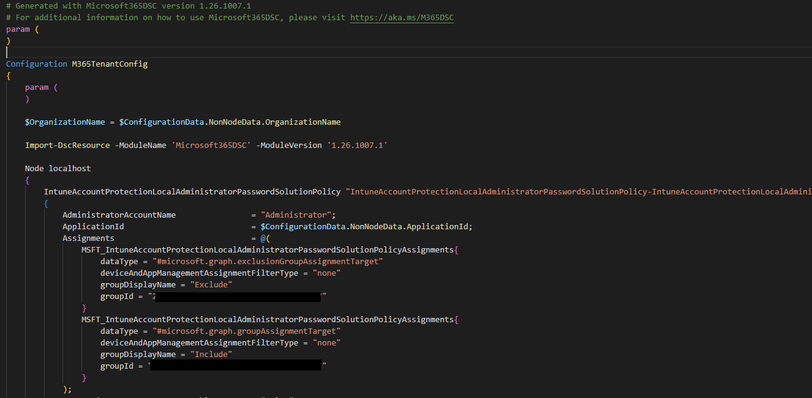
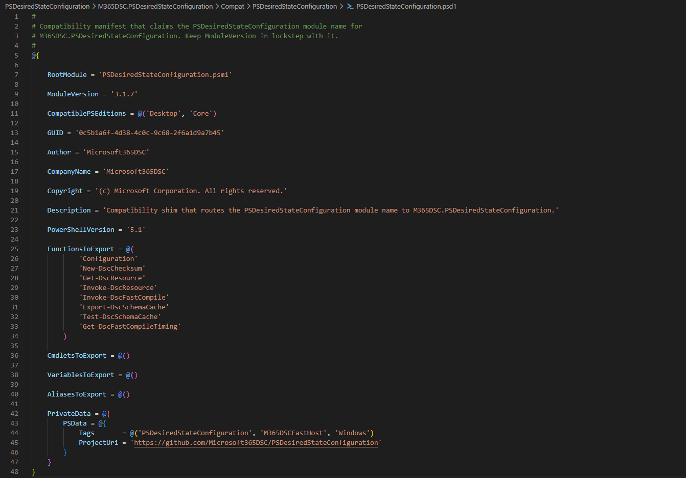
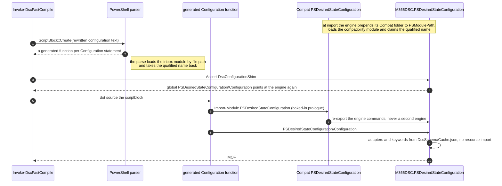
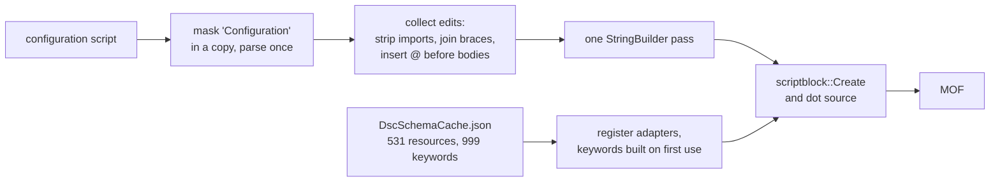
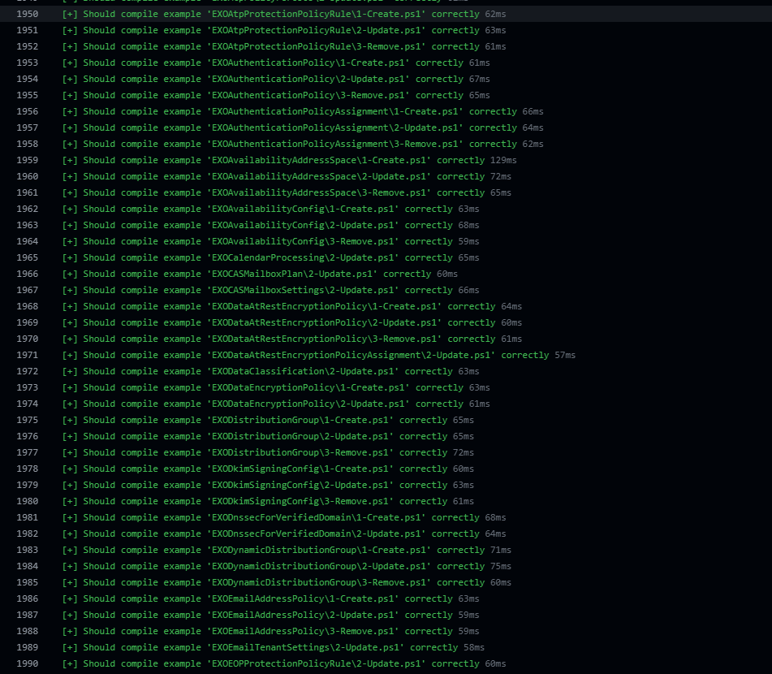
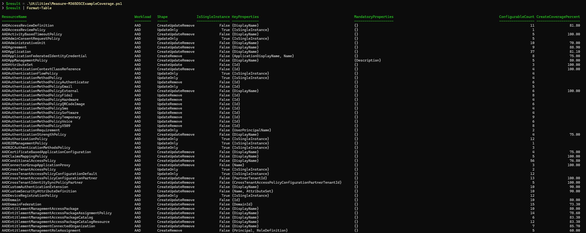

# From Script-Based to Class-Based, Part 3: Compiling Configurations, the Fast Host, and DSCv3

<b>by <a href="https://www.linkedin.com/in/fabien-tschanz">Fabien Tschanz</a> 
October 7th, 2026</b>

 
 

## Introduction

[Part 1](./class-based-resources.md) told the story about converting every Microsoft365DSC resource to a class, and [Part 2](./class-based-resources-part-2.md) made the module import, parse, and compare fast again. This part covers the cost that rose sharply when MOF files disappeared: configuration compilation.

A tenant export is a PowerShell script with a `Configuration` block and often several hundred resource instances, which the Local Configuration Manager needs compiled into MOF documents. Script-based resources took a few seconds, while class-based resources took 30 to 55 seconds for a real export and 40 to 50 seconds for a one-resource example because the DSC engine now created a thousand .NET types before recognizing a resource statement on every compile.

Our solution to the problem is a fork of `PSDesiredStateConfiguration`, published as `M365DSC.PSDesiredStateConfiguration`, whose fast compile host never asks the engine what a resource is. This part covers why the stock engine cannot be fixed externally, how the fast host works, the alternatives we rejected, how we proved output equivalence, and the laptop and CI-runner numbers before closing with DSCv3 and the final project numbers.

## Table of Contents

1. [Issue #5: Compiling a configuration became really slow](#issue-5-compiling-a-configuration-became-really-slow)
2. [Why the stock engine cannot be fixed from outside](#why-the-stock-engine-cannot-be-fixed-from-outside)
3. [A new fork and a compatibility module](#a-new-fork-and-a-compatibility-module)
4. [The tricks behind the fast host](#the-tricks-behind-the-fast-host)
5. [Dead ends](#dead-ends)
6. [Finally some numbers](#finally-some-numbers)
7. [Rebuilding the examples on top of it](#rebuilding-the-examples-on-top-of-it)
8. [DSCv3: what 3.2.3 makes of the module](#dscv3-what-323-makes-of-the-module)
9. [The project in numbers](#the-project-in-numbers)
10. [What this means for you](#what-this-means-for-you)
11. [Wrapping up](#wrapping-up)

## Issue #5: Compiling a configuration became really slow

When PowerShell parses `Import-DscResource -ModuleName Microsoft365DSC`, the DSC engine imports the module *at parse time* and creates a `DynamicKeyword` for every resource. Script-based resources require relatively cheap MOF reads. Class-based resources require .NET type creation, the same cost curve from Part 2, on every compile instead of once per session. The generated `Configuration` function then imports the same modules again at runtime.

The first measurements in August, against the 1.26.805 class build, looked like this on my laptop:

| Step | Windows PowerShell 5.1 | PowerShell 7 |
| --- | --- | --- |
| Parsing the script (parse-time import) | 28 s | 41 s |
| First execution of the configuration (runtime import) | 38 s | 55 s |
| A second compile in the same session | 28 s | 41 s |

A fresh process took 50 to 80 seconds, and a repeat took 38 to 41 seconds, for a script with only a few resources. Repeats stayed slow because `[DynamicKeyword]::Reset()` inside of the PowerShell internals for resource compilation clears the engine keyword table after each compile. The 1,700 QA examples in 1,169 files had taken about 20 minutes to validate with MOF resources. At 30 to 90 seconds per example, the same QA run became an entire workday.

The engine owns compilation inside `System.Management.Automation` and exposes no configuration for this cost. We had a correct conversion paired with a compile that was ten times slower, so we needed a different path.

## Why the stock engine cannot be fixed from outside

Every external approach we tried to get a look at the configuration hit the same limit: **a configuration script cannot be inspected without triggering the import.** `Parser.ParseInput`, `Parser.ParseFile`, `[scriptblock]::Create`, and `PSParser.Tokenize` all trigger it. Tokenizing a configuration that imports Microsoft365DSC took 23 seconds on both editions. The parser sees `Configuration`, sees `Import-DscResource`, therefore imports the module, and only then returns an AST. That is PowerShell's designed behavior, with no switch to disable it. I wish it would be different, but there is no way to bypass it from the outside.

The obvious ideas failed for clear reasons:

- **Narrowing `Import-DscResource -Name`** helps, but only up to a certain point. Importing one resource took 5.6 seconds, ten took 8.6, and forty took 9.6, compared with 42.7 seconds for the full module. The engine rebuilds its keyword table from the class cache for each script.
- **Pre-warming the keyword table** exposed through C# classes from a JSON cache took 7.9 seconds before the normal parse still took 40. The engine rebuilds its table during parsing and completely ignores external registrations.
- **Seeding the engine's class cache** through reflection sometimes parsed in 5 to 53 milliseconds and sometimes in 26 to 42 seconds. The behavior was not deterministic.

Two modules also competed for the same name: Windows PowerShell 5.1 ships `PSDesiredStateConfiguration` 1.1 under `C:\Windows\System32`, while PowerShell 7 users install version 2.0.7 from the gallery. Depending on which version you are, you might run into issues with both modules trying to compete for the same name.

## A new fork and a compatibility module

The Microsoft365DSC organization started a fork of the PSDesiredStateConfiguration based on the upstream v3.0-beta. It supported PowerShell 7 only and used a compiled .NET 6 resource-discovery subsystem. The classic LCM requires Windows PowerShell 5.1, so that branch could not support both editions. To circumvent this limitation, we rebased the fork on the pure-script **2.0.7** sources, removed the compiled subsystem, and declared both `Desktop` and `Core` in the manifest. `DscClassCache` in `System.Management.Automation` handles resource discovery on both editions, so one script module supports 5.1 and 7 without compiled code. The published `M365DSC.PSDesiredStateConfiguration` module carries the `M365DSCFastHost` PSData tag and installs with module dependencies.

Our fast path required two guarantees:

**The MOF writer had to be deterministic.** Upstream adds a banner, `Author`, `GenerationDate`, and `GenerationHost` to each document. It also writes through `Out-File`, producing UTF-16 on 5.1 and UTF-8 on PowerShell 7. The fork has one writer function and no volatile fields. These discrepancies were unacceptable for us, so with version 3.1.6 of `M365DSC.PSDesiredStateConfiguration`, it writes UTF-16LE with a byte order mark. Without the mark, the MI MOF parser decodes a document as Latin-1 and silently corrupts non-ASCII characters. While I personally love different languages, their encoding and handling in Windows is pure evil...

**The fork had to own the name `PSDesiredStateConfiguration`.** The imported module does not decide which module compiles a configuration. The PowerShell parser rewrites `Configuration Foo { ... }` into a generated function whose hardcoded prologue in `System.Management.Automation` starts with `Import-Module PSDesiredStateConfiguration` and ends by calling `PSDesiredStateConfiguration\Configuration`. Both names resolve when the configuration runs, so the module that owns the name owns the compile. Which means, we can potentially chime in and shadow the default installed module.

Our first shim was a global `PSDesiredStateConfiguration\Configuration` function. It worked at import time, then lost control when the engine loaded the inbox module by path. The shipped fix is a small compatibility module named `PSDesiredStateConfiguration` under `Compat/`. It forwards to the in-memory engine, and the engine prepends that folder to `PSModulePath` during import. Without it, one compile lets 2.0.7 or 1.1 own `Configuration`, `Get-DscResource`, and `New-DscChecksum` for the session.

The name claim is easier to follow as a sequence. This is what happens between the moment a compiled configuration starts and the moment the fast host owns the compile.

## The tricks behind the fast host

With control of the engine, `Invoke-DscFastCompile` compiles a configuration without importing the resource module. Microsoft365DSC exposes it through `Invoke-M365DSCConfigurationBuild`, which selects the fast path when the engine is installed. [Configuration Fast Compile Host](https://github.com/Microsoft365DSC/Microsoft365DSC/blob/Dev/docs/ConfigurationFastCompileHost.md) documents the full flow. These are the steps, in order.

- **Masking instead of parsing.** Every configuration parse triggers an import, so the fast host replaces each `Configuration` with `C0nfiguration` in a *copy*. The parser then sees no configuration statement and no import runs, reducing parsing to milliseconds for a small script and 0.3 to 0.5 seconds for a 726-instance export. The replacement has the same length, so AST offsets in the copy still point to the corresponding character in the untouched text.

- **Stripping `Import-DscResource`.** The masked AST gives the fast host constant module names and versions from every `Import-DscResource` statement.

- **Joining next-line braces.** Without keywords, `AADGroup 'MyGroup'` followed by `{` becomes a command and an unrelated scriptblock, so the parser loses the resource. The fast host replaces the gap with one space and does the same for nested CIM instances written as `Property = MSFT_Type` followed by a block.

- **Rewriting bodies to hashtable literals.** DSC registers resource keywords with `BodyMode = Hashtable`, so properties on the classic path can be named `User`, `Settings`, `Script`, `File`, `Group`, or `Service`. A scriptblock body makes those names live built-in keywords again and turns ordinary assignments into syntax errors. Because there are nineteen keyword names that collide with resource property names, the fast host inserts `@` before every keyword body, changing `{ ... }` to `@{ ... }`.

- **A schema cache instead of discovery.** `DscSchemaCache.json` supplies keyword definitions. The Microsoft365DSC build generates it in a child process at the end of every build and ships it with the module. It is 3.7 MB for 531 resources and 999 keywords, including embedded complex types. Each line serializes the `DynamicKeyword` that a live import would produce. Value maps use arrays of key-and-value pairs instead of JSON objects because some resources have an empty map key. The cache must pass a fingerprint check before use.

- **Read once, deserialize on demand.** `DscSchemaCache.json` uses one JSON document per line and a header index. The fast host reads the file as lines and a keyword is deserialized only when a compile uses it.

- **No `Get-Module -ListAvailable`.** Name resolution analyzes all 54 Microsoft365DSC nested modules, costing 1.1 to 1.3 seconds per call and up to 5.7 seconds on a loaded machine. The fast host instead scans `PSModulePath` for the manifest and reads `ModuleVersion` directly in 10 to 90 milliseconds.

`Get-DscFastCompileTiming` reports elapsed time for every stage of the last compile, so a slow compile no longer has to stay a mystery.

## Dead ends

During our investigation, measurements ruled out several ideas:

- **Keeping the keyword table alive between compiles** on the *classic* path (3.1.0) reduced a repeat compile from 38 seconds to 2 to 4.5. A paired A/B run showed noise on the fast path and interference with the standard-path reset, so we removed it. The fast host never populates the engine table.
- **Overriding the keyword driver** on the standard path measured a 3.7 percent difference, well within noise, and was removed.

## Finally some numbers

All September measurements ran on my Surface Laptop 6. Microsoft365DSC 1.26.1007.1 is the class-based build. Version 1.26.909.1 is the last script-based release. A fresh process is a new PowerShell process with a cold schema-cache lookup. A warm session is a second compile in that process.

The headline, the Exchange Online export with 726 instances, medians of three:

| Edition | 1.26.909.1, inbox engine | Class-based, standard pipeline | Class-based, fast host, fresh process | Fast host, warm session |
| --- | --- | --- | --- | --- |
| Windows PowerShell 5.1 | 8.6 s | 37.6 s (22.5 s of it parsing) | **7.4 s** | 5.6 s |
| PowerShell 7 | 7.3 s | 29.9 s (16.2 s parsing) | **5.2 s** | 2.1 s |

The fast host is faster than the script-based module on both editions, and its working set follows the same trend: the script-based module used 273 to 286 MB on Windows PowerShell and 461 to 472 MB on PowerShell 7, while the fast host used 187 to 207 MB and 286 to 320 MB.

Every workload, single runs, fast host 3.1.7 in a fresh process against the standard pipeline on the class-based module:

| Configuration | Instances | Windows PowerShell, standard | Windows PowerShell, fast host | PowerShell 7, standard | PowerShell 7, fast host |
| --- | --- | --- | --- | --- | --- |
| Testbed (one resource) | 1 | 50.7 s | 1.3 s | 40.9 s | 0.87 s |
| Azure AD | 227 | 34.3 s | 5.6 s | fails on 2.0.7 | 3.5 s |
| Security and Compliance | 612 | 47.8 s | 9.0 s | 34.2 s | 5.1 s |
| Exchange Online | 726 | 55.0 s | 7.9 s | 34.7 s | 5.0 s |
| Intune | 232 | 40.0 s | 10.5 s | 29.5 s | 7.3 s |

A massive improvement compared to before, and even faster than the script-based module.

**What to expect on a CI runner.** Compilation is single-threaded and depends on single-core speed, memory bandwidth, and disk cache. Validation uses GitHub `windows-latest` with 4 vCPUs and 16 GB. The [performance post](../performance-improvements/performance-improvements.md) uses an Azure DevOps Standard D2as v5 with 2 vCPUs and 8 GB. Job disks and module analysis caches start cold. The estimate is 1.5 to 2.5 times laptop results: 8 to 15 seconds for a 700-instance export in a fresh process, 2 to 3 seconds for a single-resource example, and a bit less than half a second per example in a warm process. The standard pipeline scales similarly, making one example take well over a minute on a runner.

`Invoke-M365DSCConfigurationBuild` handles the decision through its `-Engine` parameter: `Auto` selects the fast host when installed and warns before falling back, `FastHost` fails instead of falling back, and `Standard` always selects the classic path.

## Rebuilding the examples on top of it

After we got the fast host working fine, we started evaluating all of our examples against the new compilation process. After fixing all of the aforementioned issues, the result is 0.2 seconds per example, about 275 seconds for the laptop suite, with all 1,700 examples compiling and a CI estimate of eight to twelve minutes.

The QA gate exposed accumulated inconsistencies. Each resource has up to three examples, with these rules:

- `1-Create.ps1` sets every configurable non-authentication property, with values a real tenant would plausibly hold.
- `2-Update.ps1` keeps the same coverage and differs from create in at least one property, with each differing line marked `# Updated Property`.
- `3-Remove.ps1` carries keys, mandatory properties, authentication and `Ensure = 'Absent'`, and nothing beyond that.
- Across all three, the keys are byte-identical, no property is undeclared, and no enum value is invalid.

`Utilities/Measure-M365DSCExampleCoverage.ps1` is a read-only analyzer that reports schema coverage, update drift, and remove-example properties outside the allowed set to determine whether a workload is complete. Examples now use certificate authentication, which we recommend across workloads, and place authentication properties at the end of each block so the resource configuration comes first.

The example generator also needed fixes because it dropped mandatory properties from remove examples when `[DscProperty(Mandatory)]` began rendering as `Required`, placed key property `IsSingleInstance` last, and used `FakeStringValue` for every string placeholder. The generator now handles all three at the source.

## DSCv3: what 3.2.3 makes of the module

DSCv3 was one of the three reasons for this conversion because its PowerShell adapter drives only class-based resources. We tested the shipped module with `dsc.exe` 3.2.3, adapter source, and Gijs Reijn's posts on adapted resource manifests, and found that the shipped adapter currently finds nothing because the fault is in the adapter, not the module. After an update, that one was fixed. And with a little bit of help of Gijs, we were able to get adapted resource manifests working correctly.

**Adapted resource manifests work with a mini module per resource.** DSC 3.2 introduced `*.dsc.adaptedresource.json` manifests. They identify a resource path, required adapter, and embedded JSON schema. The adapter imports the supplied path instead of performing discovery. We prototyped a generator that emits `AdaptedResources/<Name>/Microsoft365DSC.psd1` and `.psm1` for each resource. The module contains a `using module` line for its shared base class and type buckets, a global import of the 28 helper modules, and the class text. Each resource also gets a manifest with `requireAdapter Microsoft.Adapter/PowerShell`, get, set, and test capabilities, and schema from the cache. The output contains 531 resources and is 13.9 MB.

| Command | Result, medians of two |
| --- | --- |
| `dsc resource list` | 531 `Microsoft365DSC/*` rows plus the built-ins in 5.4 s |
| `dsc resource schema --resource Microsoft365DSC/AADGroup` | embedded schema in 5.3 s |
| `dsc resource get --resource Microsoft365DSC/AADGroup` with a bogus tenant | reaches the certificate lookup in `Get-MSCloudLoginCertificate` after 13.5 s |
| `dsc resource test` | same path, 14.0 s |
| `dsc config get` with two resources | same path per resource, 13.4 s |

`dsc resource list` now shows all 531 Microsoft365DSC rows. A 13.5-second `get` includes 5.4 seconds of manifest discovery, 2.1 seconds of validation, and 5.5 seconds for `get`, including 2.2 seconds importing the mini module. Each adapter operation starts `pwsh` twice, once for validation and once for execution, so package shape cannot change that process model. A mini module saves about 3 seconds per operation against a 5-second full `Import-Module Microsoft365DSC`, and it is the only shape the shipped adapter can drive.

## The project in numbers

A summary of the project in figures, since I know some of you scroll straight here:

| Metric | Value |
| --- | --- |
| Resources converted | 535 (every one) |
| Unit test suites converted | 534, ~5,500 tests |
| Resource code before | 454,646 lines / 16.4 MB |
| Resource code after | 325,451 lines / 13.6 MB (−129,195 lines, ≈ 28%) |
| `.schema.mof` files deleted at cutover | 530+ |
| `$PSBoundParameters` call sites replaced | 6,949 |
| PowerShell edition shim blocks collapsed into one base-class guard | 2,132 |
| Complex-type classes generated and deduplicated | ~470, with 543 inheritance edges preserved |
| Cold import: shipping layout, PowerShell 7 / Windows PowerShell | 4.96 s / 5.67 s (script-based release: 1.67 s / 1.97 s) |
| `Get-DscResourceV2`, warm, DSCParser 3.1.0.3 → 3.1.0.4 | 2.9 to 3.1 s → 23 to 44 ms |
| Parsing an export with DSCParser, 726 instances | 272 to 283 ms → 92 to 105 ms |
| Drift comparison of the Exchange Online export | 454 ms → 21 ms |
| Full Intune export, same tenant, August → September | 284 s → 72 to 92 s, 466 → 149 Graph requests |
| Full Exchange Online export | 1,163 s → 396 s |
| Full Security and Compliance export | 424 s → 198 s |
| Compile, 726 instances, fast host, fresh process | 5.2 s (PowerShell 7), 7.4 s (Windows PowerShell) |
| Compile, one resource, fast host, warm session | 0.2 s |
| DSCv3 through the shipped adapter | 0 resources. Generated adapted manifests expose 531 |
| Time from proposal to release | June 20th, 2025 -> October 2026 |

## What this means for you

For most users, little changes. That was the design goal.

- **Your configurations keep working.** Existing `Configuration` scripts, including complex embedded-instance properties, compile unchanged and to the same MOF, and resource names are identical.
- **PowerShell 7 is now a requirement**, as announced in July. The classic LCM on Windows PowerShell 5.1 continues through the built-in relay. Hybrid environments that depend on LCM drift remediation remain supported.
- **`Get-DscConfiguration` with nested properties works now** (issue #6120), since typed classes fixed the CIM inference failure structurally.
- **Importing the module costs about 5 seconds** on PowerShell 7 and a bit more on Windows PowerShell. Part 2 explains where every one of those seconds goes and why we did not buy them back with a layout that DSCv3 cannot use.
- **The examples are worth reading again.** Every resource has a create, an update and a remove example that compile, cover the schema and use certificate authentication.
- **For contributors,** resource work stays in one file in the same folder, now as a class instead of three functions and about 40% shorter. Build before testing because Pester loads generated parts, not the source file.

## Wrapping up

Microsoft365DSC now runs all 530+ class-based DSC resources, with each property defined once and a shared base class replacing almost half a million lines of repeated boilerplate. MOF files are gone, PowerShell 7 is native, the comparison engine reports real drift, and real tenant exports compile faster than they did with script-based resources on both editions.

The project relied on measurement throughout: we tested risks before committing, used an AST-based converter for mechanical changes, reviewed what it could not prove, and measured again whenever a result came back slow.

For an unexpected configuration compile failure, incorrect drift report, or hardware-specific import regression, open an issue with the resource name and relevant details.

Thanks for reading all three parts and for using Microsoft365DSC. You are legends!
